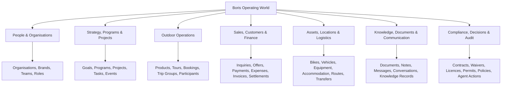
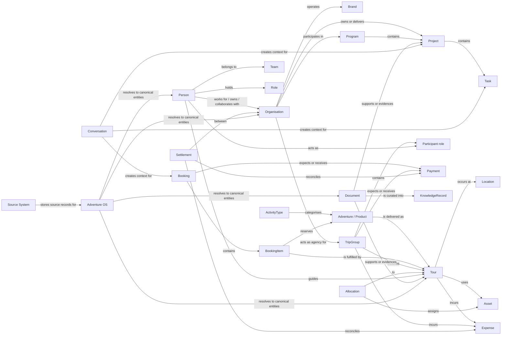
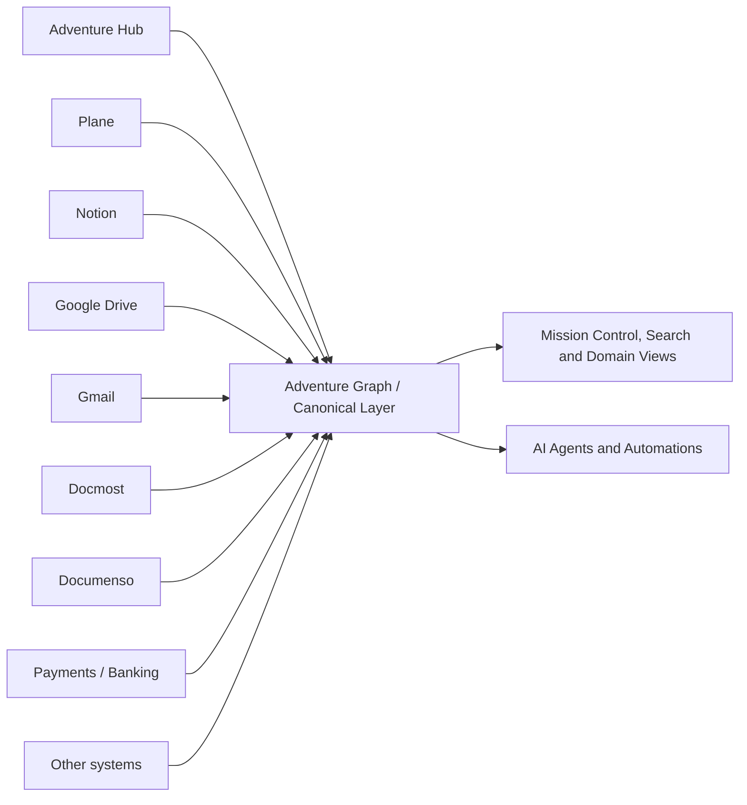

# Adventure OS — World Map

**Status:** Draft for review  
**Version:** 0.1  
**Date:** 2026-07-17  
**Owner:** Boris Stijepović  
**Purpose:** Extend, not replace, `docs/DOMAIN_MODEL.md`.

## 1. What this document is

The World Map is a business-reality view of the Adventure OS domain.

It shows the major parts of Boris's operating world and the relationships between them before those concepts are translated into databases, integrations, user interfaces or AI agents.

This is not:

- a database schema;
- an application sitemap;
- an organisation chart;
- a source-system inventory;
- a replacement for `DOMAIN_MODEL.md`, `KNOWLEDGE_GRAPH.md` or `SYSTEM_ARCHITECTURE.md`.

The existing `DOMAIN_MODEL.md` remains the canonical vocabulary. This document adds a higher-level spatial and relational view of that vocabulary.

## 2. Modelling boundaries

The map separates five different kinds of things that were previously easy to mix together:

1. **Reality** — people, organisations, work, operations, money, assets, knowledge and obligations.
2. **Operating structures** — domains, programs, projects and teams that organise reality.
3. **Records** — bookings, payments, documents, tasks, messages and other evidence of activity.
4. **Source systems** — Adventure Hub, Plane, Notion, Drive, Gmail, Docmost and other systems that hold records.
5. **Adventure OS** — the control plane that connects canonical entities without replacing every specialist system.

A source system is not a business entity. An application is not the centre of the world map.

## 3. Top-level world

## 4. Operating structures

### 4.1 Organisations and brands

Current known organisations and initiatives include:

- **Durmitor Adventure** — core operating company and tourist agency.
- **Wild Collective** — production, events and outdoor storytelling initiative.
- **WBATA** — regional adventure travel association.
- **DiscoverMNE** — future tourism platform initiative.
- **Adventure OS** — internal operating-system project, not a legal organisation.

Important distinction:

- an **Organisation** is a legal, operational or community body;
- a **Brand** is a public identity that may be operated by one or more organisations;
- a **Project** is bounded work;
- a **Program** is a long-lived operating structure.

### 4.2 Business domains

The current top-level business domains are:

- Operations
- Finance
- People
- Assets and equipment
- Sales and customer relationships
- Marketing and media
- Knowledge and documentation
- Communication
- Strategy and projects
- Compliance and governance
- Technology and integrations

These domains may cross organisations and brands. They should not be modelled as subsidiaries or software modules by default.

### 4.3 Programs and projects

Examples of long-lived programs:

- Daily activities program
- Multiday e-bike program
- Fleet and equipment program
- Agency sales program
- Events program
- Media and content program

Examples of bounded projects:

- Adventure OS
- Durmitor Adventure website redesign
- XElements 2026
- DiscoverMNE development
- Equipment import batches
- Travelife certification
- National Park management-plan proposals

## 5. Core relationship map

## 6. Domain clusters and their central entities

### 6.1 Identity and organisation

Central entities:

- Person
- Organisation
- Brand
- Team
- Role

Rules:

- A Person exists once and may hold many contextual roles.
- Participant, Customer, Guide, Employee, Owner and Partner are normally roles or relationships, not duplicate identity records.
- Agency is a role/type of Organisation.
- A Team may span organisations and brands.

### 6.2 Strategy and work

Central entities:

- Goal
- Program
- Project
- Initiative
- Task
- Idea
- Decision
- Event
- Milestone

Rules:

- A Program is persistent and may contain Projects.
- A Project has a bounded objective and lifecycle.
- An Event may be both a real-world occurrence and the subject of one or more Projects.
- Tasks belong to work; they are not the same as reminders or operational events.

### 6.3 Outdoor operations

Central entities:

- ActivityType
- Adventure / Product
- Tour
- Booking
- BookingItem
- TripGroup
- Participant
- GuideAssignment
- Schedule
- Route
- Location

Rules:

- ActivityType is the category.
- Adventure/Product is the sellable configuration.
- Tour is the actual operational delivery.
- Booking is the commercial reservation container.
- BookingItem is one selected product/date within a Booking.
- TripGroup is a coherent multiday operating unit.

### 6.4 Assets and logistics

Central entities:

- Asset
- Bike
- Vehicle
- EquipmentItem
- Accommodation
- Room
- Location
- Transfer
- Allocation
- ServiceRecord

Rules:

- Bike and Vehicle are specialised Assets.
- Allocation is time-bound; ownership is not.
- EquipmentItem may represent individually tracked equipment or inventory quantity, depending on operational need.
- Accommodation and Room are resources but not necessarily owned assets.

### 6.5 Commercial and finance

Central entities:

- Inquiry
- Offer
- Customer role
- Payment
- Expense
- Transaction
- Invoice
- Settlement
- CostCenter

Rules:

- Customer is a role held by a Person or Organisation.
- Payment and Expense should be used when direction and business meaning are known.
- Settlement reconciles collections, expenses, fees and profit-share obligations between organisations.
- CostCenter cuts across legal entities, programs and activities; it is not automatically an Organisation.

### 6.6 Knowledge and communication

Central entities:

- Document
- KnowledgeRecord
- Note
- Message
- Conversation
- Meeting
- Media
- SourceReference

Rules:

- Documents remain in their authoritative source where appropriate.
- KnowledgeRecord represents curated meaning derived from evidence.
- A Conversation can provide context to many business entities without becoming their authoritative record.
- SourceReference links a canonical entity to external records.

### 6.7 Governance and compliance

Proposed central entities for confirmation:

- Contract
- Waiver
- Licence
- Permit
- Certificate
- InsurancePolicy
- ComplianceRequirement
- Inspection
- Policy
- AuditRecord
- AgentAction

These were underrepresented in the original domain model and should be validated before being promoted to canonical entities.

## 7. Time as a cross-cutting dimension

Time should not initially be treated as a separate business domain. It is a dimension carried by most entities and relationships.

Examples:

- a Role is effective during a period;
- an Allocation reserves an Asset for a period;
- a Tour occurs at a scheduled time;
- a Project has milestones and deadlines;
- a Licence has validity dates;
- a Payment has expected, received and settled dates;
- a source relationship has an observed date.

Where a named time object has independent business meaning, it may be an entity, for example Season, Schedule, Event or Milestone.

## 8. Source systems sit outside the business model

Examples of source systems:

- Adventure Hub
- Plane
- Notion
- Google Drive
- Gmail
- Google Calendar
- Docmost
- Documenso
- Mattermost
- Slack
- WhatsApp
- Viber
- Zoho
- WSPay / Monri
- CKB and banking systems
- accounting and fiscalisation systems
- Outdooractive

Their role is to hold or process source records. They do not define the canonical business ontology.

## 9. Relationship principles

1. Relationships should be expressed as explicit verbs, not vague lines.
2. Every relation should have provenance and confidence where inferred.
3. Roles should be contextual and time-bound where relevant.
4. Source-system references must not become global identity.
5. A canonical entity may have records in several systems.
6. Adventure OS should not claim authority over data owned by specialist systems.
7. The model should describe real operational meaning before implementation convenience.

## 10. Confirmed decisions inherited from existing documentation

- Adventure OS is a control plane above specialist systems, not a universal replacement.
- Stable canonical identities are distinct from source-system IDs.
- Person is the identity; Participant, Customer and Guide are contextual roles.
- Organisation and Brand are distinct.
- ActivityType, Adventure/Product and Tour are distinct.
- Booking and BookingItem are distinct.
- Project and TripGroup are distinct.
- Asset and EquipmentItem are distinct.
- Document and KnowledgeRecord are distinct.
- Relationship confidence is `confirmed`, `probable` or `suggested`.

## 11. New proposals in v0.1 requiring review

The following are proposed, not yet confirmed:

1. Introduce **Program** as a canonical operating structure distinct from Project.
2. Introduce **Goal**, **Milestone** and possibly **Initiative** in the strategy domain.
3. Introduce **CostCenter** as a cross-cutting finance entity.
4. Expand governance entities to Contract, Waiver, Licence, Permit, Certificate, InsurancePolicy, ComplianceRequirement and Inspection.
5. Treat **time as a cross-cutting dimension**, not a standalone top-level domain.
6. Treat **Technology and AI as system capabilities**, not business-reality domains.
7. Use **Adventure/Product** as a temporary combined label until naming is resolved.

## 12. Open questions

1. Should `Program` become a canonical entity, and what precisely distinguishes it from BusinessDomain and Project?
2. Should the canonical sellable entity be named `Adventure`, `Product`, `ServiceProduct` or something else?
3. Does `Tour` represent only one operational departure, while a multiday itinerary consists of Tour segments under a TripGroup?
4. Should `Accommodation` and `Room` be first-class entities or external resource references?
5. Should `CostCenter` be an entity, a classification or both?
6. Are compliance objects first-class canonical entities or specialised Documents with lifecycle metadata?
7. Where does Media belong: Knowledge, Marketing, Asset or a distinct content domain?
8. Should Project, Idea and Task all be authoritative in Plane, or should Plane initially remain Tasks-only?
9. Which relationships are legal ownership, operational responsibility, commercial participation or temporary assignment? These must not collapse into a generic `belongsTo`.
10. Which parts of the map apply only to Durmitor Adventure, and which are universal across Wild Collective, WBATA and DiscoverMNE?

## 13. Review request for Claude

Review this document against:

- `docs/MASTER.md`
- `docs/PROJECT_CONSTITUTION.md`
- `docs/DOMAIN_MODEL.md`
- `docs/KNOWLEDGE_GRAPH.md`
- `docs/SYSTEM_ARCHITECTURE.md`
- `docs/SOURCE-MAP.md`
- `docs/decisions/*`
- open PRs #16 and #17

The review should answer:

1. Does this contradict any existing confirmed decision?
2. Which concepts duplicate existing entities under different names?
3. Which missing relationships are required by the current business model?
4. Which proposed entities should remain classifications or roles instead?
5. Does the map incorrectly mix reality, records, source systems and software?
6. What minimal changes would produce World Map v0.2 without redesigning the documentation structure?

Do not rewrite the project from zero. Return a focused diff proposal and classify each recommendation as:

- **Conflict** — contradicts an existing confirmed decision;
- **Gap** — missing from the existing model;
- **Clarification** — wording or boundary needs tightening;
- **Future** — useful but premature.

## 14. Next step

After review:

1. incorporate only accepted changes into World Map v0.2;
2. update `DOMAIN_MODEL.md` with a short link to this document and any confirmed new entities;
3. derive a canonical relationship catalogue from the accepted map;
4. use the accepted relationship catalogue to evaluate the System Map prototype in PR #17.
